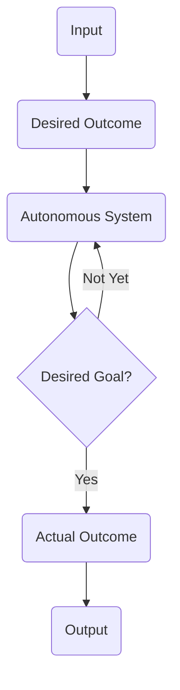

[[IS1108 Home Page]]
### Goal of Automated Systems

**Automation** is the ability of a system to perform *well-defined* tasks to produce deterministic results. This is done by closely following a set of rules and algorithms without the reliance of AI technologies.

**Example:** Washing Machine, Vending Machine, Inventory Logger, etc
### Goal of Autonomous Systems

**Autonomous Systems** are the next step in the evolution of automation. Here AI is applied to the system.

**Example:** Self-Driving Car, Drones, Anti-Missile System, etc

### Key Challenges in Autonomous Systems

- Principle of Double Effect - from topic 1
- Autonomous Driving
- Autonomous Care-giving 

![[IS1108 - Autonomous Systems.png]]

### Impact
- **Low Impact** is when the environment is constrained. An autonomous train is low impact as it is confined to its train tracks vs a self-driving car which can go onto all roads and is therefore **high impact**. It can also be said to be the degree by which it can affect human life.
### Autonomy
- **Low autonomy** is when there is high human involvement, and **high autonomy** would be the opposite.

## Considerations of ethical automation
There are many considerations that need to be addressed when making Autonomous Systems. Here's a few:
- Safety
- Privacy and data security
- Liability
- Effects to the incumbent workforce
- Autonomy and independence
- Social connectedness and human interaction
- Objectification and infantilisation
- Deception and anthromorphisation
- Social justice, etc

