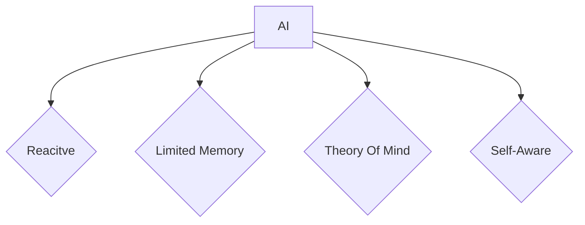

[[IS1108 Table of Contents]]

## What is AI

Branch of computer science dedicated to the creation of intelligent machines that can do work and react like humans. As such, we as professionals should have ethics to guide us to prevent misuse of such powerful tools.

There are different kinds of AI: 

There are three main ethical concerns regarding the use of AI: 
1. Privacy
2. Bias and Discrimination
3. Human Judgement

To minimise these concerns, we must develop AI systems with the following pillars as a foundation:

![[IS1108 - Pillars of AI.png]]

All of these concepts can be summarised in two **guiding principles**: 
> Decisions made by AI systems must be "explainable, transparent and fair"

We should not deploy AI systems whose inner workings we are unable to fully understand as it will lead to unpredictable outcomes.

> AI systems should be human-centric

The implementation of AI systems must not cause harm to humans, either directly or as a by-product (loss of employment). There should be a way to help those that are affected.

## AI Governance

**Governance** is the idea that there should be legal frameworks that ensure AI and machine  
learning technologies are well researched and developed with the goal of helping humanity navigate the adoption of AI systems fairly. 

### Body of Knowledge (BoK)

Provides guidance to business leaders and professionals on how to deploy AI responsibly. 

### Guiding principles in practice

The following four concepts can be used as metrics for AI Governance:
1. Internal governance: Incorporate values, risks and responsibilities relating to algorithmic
decision making
2. Operations management
3. Human-centricity: Determine level of human involvement in AI decision making
4. Stakeholder Communications
